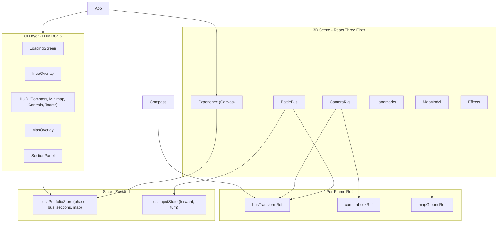

# TINTIN Portfolio — Project Description

## Overview

**TINTIN Portfolio** is a Fortnite-themed interactive 3D portfolio website. Visitors fly a Battle Bus over a Chapter 2 Season 7-style island map, discover glowing landmark POIs (Points of Interest), and open portfolio sections (About, Projects, Skills, Experience, Contact) through in-world interaction. The experience mimics Fortnite's drop-in flow: loading screen → cinematic bus flyover → free flight → POI exploration.

The project is branded as **TINTIN Portfolio** (`PORTFOLIO_NAME = 'TINTIN'` in [`src/data/sections.ts`](../src/data/sections.ts)), with the browser tab title set to `tintin portfolio` in [`index.html`](../index.html).

---

## Tech Stack

| Layer | Technology | Version (approx.) |
|-------|------------|-------------------|
| Framework | React | 19.x |
| Build | Vite | 6.x |
| Language | TypeScript | 5.8 |
| 3D | Three.js | 0.175 |
| 3D React bindings | @react-three/fiber | 9.x |
| 3D helpers | @react-three/drei | 10.x |
| Post-processing | @react-three/postprocessing | 3.x |
| State | Zustand | 5.x |
| Mobile controls | nipplejs | 0.10 |
| Fonts | Bungee + Inter (Google Fonts) | — |

Entry point: [`src/main.tsx`](../src/main.tsx) mounts `<App />` inside React `StrictMode`.

---

## High-Level Architecture



The app splits into two parallel layers:

1. **3D Canvas** — rendered by [`src/scene/Experience.tsx`](../src/scene/Experience.tsx) inside a `scene-shell` wrapper in [`src/App.tsx`](../src/App.tsx).
2. **HTML UI overlays** — loading screen, intro, HUD, map modal, section panels.

State flows through **Zustand** stores; high-frequency transform data (bus position/rotation, camera look) uses **mutable refs** to avoid React re-render churn every frame.

---

## Application Phases

The app lifecycle is driven by a `phase` enum in [`src/state/store.ts`](../src/state/store.ts):

```typescript
export type Phase = 'loading' | 'intro' | 'drive' | 'panel'
```

| Phase | What happens |
|-------|--------------|
| `loading` | 3D assets preload via `@react-three/drei` `useProgress`. Loading bar animates 0→100%. Scene is hidden (`scene-shell--hidden`). |
| `intro` | Battle Bus follows a scripted spline path. Welcome overlay with "Drop In" button. Auto-transitions to `drive` after 8s. |
| `drive` | Player controls the bus (WASD / joystick). POI proximity detection active. Full HUD visible. |
| `panel` | A portfolio section modal is open. Bus movement frozen; camera still follows bus. |

Phase transitions:

- **loading → intro**: When `useProgress` reports `!active && progress >= 100`, after a 900ms hold at 100% ([`Experience.tsx` LoadingWatcher](../src/scene/Experience.tsx)).
- **intro → drive**: User clicks "Drop In", presses Space, or 8s timeout ([`IntroOverlay.tsx`](../src/ui/IntroOverlay.tsx)).
- **drive → panel**: User presses E near a POI or clicks interact button ([`HUD.tsx`](../src/ui/HUD.tsx)).
- **panel → drive**: User presses Esc or closes panel ([`store.ts`](../src/state/store.ts) `closeSection`).

---

## Directory Structure

```
tintin/
├── context/                    # Project documentation (this file)
├── 3d models/                  # Source GLB assets (not served directly)
│   ├── battle_bus_fortnite.glb
│   ├── chapter2_season7_map.glb
│   ├── map_with_edges.glb
│   ├── cloud_test.glb
│   └── laser_beam_v2.glb
├── public/
│   ├── models/                 # Served GLB assets (copied from 3d models/)
│   │   ├── battle_bus.glb
│   │   ├── map_with_edges.glb
│   │   ├── cloud_test.glb
│   │   └── laser_beam_v2.glb
│   └── mapimage.webp           # 2D minimap / full-map background image
├── src/
│   ├── App.tsx                 # Root layout: scene shell + UI overlays
│   ├── main.tsx                # React entry
│   ├── index.css               # All styles (HUD, loading, compass, etc.)
│   ├── controls/               # Input hooks (keyboard, joystick, mouse look)
│   ├── data/                   # Config: sections, theme, bus tuning
│   ├── hooks/                  # React hooks (site stats)
│   ├── scene/                  # Three.js / R3F components
│   ├── state/                  # Zustand stores
│   ├── ui/                     # HTML overlay components
│   └── utils/                  # Shared utilities (damp)
├── index.html
├── package.json
├── vite.config.ts
└── README.md
```

---

## State Management

### Portfolio Store — [`src/state/store.ts`](../src/state/store.ts)

Central app state:

```typescript
interface PortfolioState {
  phase: Phase
  activeSection: SectionId | null
  nearbySection: SectionId | null
  mapOpen: boolean
  bus: BusState                    // position [x,y,z], rotation (radians)
  introProgress: number            // 0–1 intro spline progress
  loadProgress: number             // 0–100 asset load %
  // ...actions: setPhase, openSection, closeSection, toggleMap, etc.
}
```

Key actions:

- `openSection(section)` → sets `activeSection` and `phase: 'panel'`
- `closeSection()` → clears section, returns to `phase: 'drive'`
- `toggleMap()` / `setMapOpen()` → full-screen map overlay
- `setLoadProgress` → monotonic (never decreases): `Math.max(state.loadProgress, loadProgress)`

### Input Store — [`src/state/inputStore.ts`](../src/state/inputStore.ts)

Separate store for per-frame movement input:

```typescript
interface ControlInput {
  forward: number   // -1 to 1
  turn: number      // -1 to 1
}
```

Written by [`useBusControls.ts`](../src/controls/useBusControls.ts) every animation frame; read by [`BattleBus.tsx`](../src/scene/BattleBus.tsx).

### Per-Frame Refs (non-React)

| Ref | File | Purpose |
|-----|------|---------|
| `busTransformRef` | [`src/scene/busTransformRef.ts`](../src/scene/busTransformRef.ts) | Bus position + rotation updated every `useFrame`. Used by camera, compass. |
| `cameraLookRef` | [`src/scene/cameraLookRef.ts`](../src/scene/cameraLookRef.ts) | Mouse-look yaw/pitch offsets for chase camera. |
| `mapGroundRef` | [`src/scene/mapGroundRef.ts`](../src/scene/mapGroundRef.ts) | Map ground Y and radius, set when map GLB loads. Used by edge clouds. |

Bus position syncs to Zustand store at **10 Hz** (every 0.1s) for UI components like minimap; compass reads the ref directly at 60fps for smooth scrolling.

---

## 3D Scene Components

All 3D content mounts inside [`Experience.tsx`](../src/scene/Experience.tsx):

```tsx
<Canvas shadows dpr={[1, 1.5]} camera={{ fov: 55, near: 1, far: 3000 }} ...>
  <SkyEnvironment />
  <Lighting />
  <Suspense fallback={null}>
    <MapModel />
    <EdgeCloudWall />
    <SkyClouds />
    <BattleBus />
    <Landmarks />
    <CameraRig />
    <MouseLookControls />
    <Effects />
    <LoadingWatcher />
    <Preload all />
  </Suspense>
</Canvas>
```

### Map — [`src/scene/Map.tsx`](../src/scene/Map.tsx)

- Loads `/models/map_with_edges.glb` via `useGLTF`.
- Scales and centers the map to fit `MAP_BOUNDS` (800×800 units, ±400 on X/Z).
- Enables shadow cast/receive on all meshes.
- Writes `mapGroundRef.groundY` and `mapGroundRef.mapRadiusXZ` for cloud placement.

### Battle Bus — [`src/scene/BattleBus.tsx`](../src/scene/BattleBus.tsx)

The player vehicle. Core movement logic in `useFrame`:

**Intro mode** — follows `INTRO_PATH` spline (4 waypoints):

```typescript
const INTRO_PATH = [
  new THREE.Vector3(-300, 120, -250),
  new THREE.Vector3(-100, 110, -50),
  new THREE.Vector3(100, 100, 80),
  new THREE.Vector3(250, 95, 200),
]
```

**Drive mode** — reads `inputStore`, applies damped forward/turn:

```typescript
s.forwardSpeed = damp(s.forwardSpeed, targetForward, BUS_CONFIG.forwardDamping, delta)
s.turnRate = damp(s.turnRate, targetTurn, BUS_CONFIG.turnDamping, delta)
s.rotation += s.turnRate * delta
s.position.x += Math.sin(s.rotation) * s.forwardSpeed * delta
s.position.z += Math.cos(s.rotation) * s.forwardSpeed * delta
```

Bus config from [`sections.ts`](../src/data/sections.ts):

```typescript
export const BUS_CONFIG = {
  height: 80,
  speed: 120,
  turnSpeed: 1.2,
  forwardDamping: 5,
  turnDamping: 7,
  scale: 1,
  visualYawCorrection: Math.PI,
}
```

**POI proximity** — each frame, finds nearest section within `INTERACT_RADIUS` (55 units) and updates `nearbySection` in store.

**Model prep** — [`prepareBusModel.ts`](../src/scene/prepareBusModel.ts) scales to ~40 units, centers, rotates length to +Z, applies yaw correction.

**Lights** — two bus-local point lights (warm + cool) follow the bus for visibility.

### Landmarks — [`src/scene/Landmarks.tsx`](../src/scene/Landmarks.tsx)

Five POI markers at positions defined in `sections` array. Each marker has:

1. **Laser beam** — GLB model (`laser_beam_v2.glb`), prepared by [`prepareLaserBeam.ts`](../src/scene/prepareLaserBeam.ts):
   - Rotated upright (Sketchfab export is along Z)
   - Scaled to `TARGET_BEAM_HEIGHT = 1000` (extends into sky, no visible cap)
   - Tinted per-section color (50% color lerp, 35% emissive)
   - Opacity pulses when nearby (0.55 vs 0.25)
   - X/Z scale pulse when nearby (height stays fixed)

2. **Ground ring** — colored `ringGeometry`, rotates and bobs

3. **HTML label** — `Billboard` + `Html` from drei, shows icon + section name

### Camera — [`src/scene/CameraRig.tsx`](../src/scene/CameraRig.tsx)

Third-person chase camera using spherical offset from bus:

```typescript
const azimuth = rot + Math.PI + lookYaw
const elevation = baseElevation + lookPitch
const targetPos = sphericalOffset(azimuth, elevation, distance, busPos)
```

- Intro: distance 95, elevation 0.35
- Drive: distance 78, elevation 0.32 + mouse look offsets
- Smoothed with `damp()` utility ([`src/utils/damp.ts`](../src/utils/damp.ts))

### Environment

| Component | File | Description |
|-----------|------|-------------|
| Sky | [`SkyEnvironment.tsx`](../src/scene/SkyEnvironment.tsx) | `@react-three/drei` `<Sky>` with turbidity/rayleigh from [`theme.ts`](../src/data/theme.ts) |
| Lighting | [`Lighting.tsx`](../src/scene/Lighting.tsx) | Ambient + directional (shadows) + hemisphere lights |
| Edge clouds | [`EdgeCloudWall.tsx`](../src/scene/EdgeCloudWall.tsx) | Instanced `cloud_test.glb` in rings around map edge |
| Sky clouds | [`SkyClouds.tsx`](../src/scene/SkyClouds.tsx) | Floating cloud instances in the sky |
| Post-FX | [`Effects.tsx`](../src/scene/Effects.tsx) | Bloom (threshold 0.72, intensity 0.22) + vignette |

### Mouse Look — [`src/controls/useMouseLook.ts`](../src/controls/useMouseLook.ts)

Double-click to enter pointer lock; drag to adjust `cameraLookRef.yaw` and `cameraLookRef.pitch`. Only active during `drive` phase.

---

## UI Layer

### Loading Screen — [`src/ui/LoadingScreen.tsx`](../src/ui/LoadingScreen.tsx)

- Visible during `phase === 'loading'`
- Shows "TINTIN Portfolio" logo, progress bar, percentage
- Smooth animated fill via `requestAnimationFrame` (creeps toward target, holds at 100% before phase change)
- Scene is completely hidden behind opaque gradient during load ([`App.tsx`](../src/App.tsx) `scene-shell--hidden`)

### Intro Overlay — [`src/ui/IntroOverlay.tsx`](../src/ui/IntroOverlay.tsx)

- "Welcome to TINTIN Portfolio" with Drop In button
- **Space** or click to skip intro
- Fades in when `introProgress > 0.15`
- Auto drop-in after 8 seconds

### HUD — [`src/ui/HUD.tsx`](../src/ui/HUD.tsx)

Main in-game UI during `drive` and `panel` phases. Contains:

#### Compass — [`src/ui/Compass.tsx`](../src/ui/Compass.tsx)

Fortnite-style heading bar at top-center:

- Reads `busTransformRef.rotation` every frame via `requestAnimationFrame`
- Scrolls tick marks (every 15°) and cardinal labels (N, NE, E, SE, S, SW, W, NW)
- Center readout shows e.g. `SE 144`
- Edge fade mask for reference-style appearance

#### Controls Panel (top-left)

Vertical list of keyboard hints:

- Double-click to look
- WASD / Arrows to fly
- E to interact
- M to open map
- B to thank the bus driver
- Esc to close

Hidden on mobile (`@media max-width: 768px`).

#### Minimap — [`src/ui/Minimap.tsx`](../src/ui/Minimap.tsx)

Top-right sharp square map:

- Background: `/mapimage.webp`
- POI dots colored by section
- Bus marker (yellow diamond)
- **Stats row** below map (via [`useSiteStats.ts`](../src/hooks/useSiteStats.ts)):
  - Clock icon + session timer (`M:SS`)
  - People icon + visitor count (localStorage, one per session)
  - Heart icon + like count (toggleable, localStorage)

#### Interact Button (bottom-center)

Appears when bus is within `INTERACT_RADIUS` of a POI. Styled with section color. Opens section on click.

#### Thank-You Toasts (bottom-left)

Press **B** during drive → "Thanks for the ride, bus driver!" toast slides in, auto-dismisses after 3s. Count increments on repeat presses.

#### Map Overlay — [`src/ui/MapOverlay.tsx`](../src/ui/MapOverlay.tsx)

Full-screen map modal toggled with **M**:

- Large square map with POI labels and bus marker
- Close via Esc, M, backdrop click, or X button
- Does not pause bus movement (`phase` stays `drive`)

### Section Panel — [`src/ui/SectionPanel.tsx`](../src/ui/SectionPanel.tsx)

Modal dialog for portfolio content. Renders different item types per section:

- **Projects** → cards with title, description, tags, link
- **Experience** → role, company, period, description
- **About / Skills / Contact** → list items (contact items become mailto/links)

Content defined in `sectionContent` in [`sections.ts`](../src/data/sections.ts).

---

## Portfolio Sections (POIs)

Five landmarks on the island, configured in [`src/data/sections.ts`](../src/data/sections.ts):

| ID | Label | Color | Position [x, y, z] | Icon |
|----|-------|-------|---------------------|------|
| `about` | About Me | `#4fc3f7` | [-180, 0, -120] | 👤 |
| `projects` | Projects | `#ffd54f` | [200, 0, -80] | 🎯 |
| `skills` | Skills | `#81c784` | [-60, 0, 200] | ⚡ |
| `experience` | Experience | `#ce93d8` | [140, 0, 160] | 🏆 |
| `contact` | Contact | `#ff8a65` | [-220, 0, 180] | 📡 |

Interaction radius: **55 units** (`INTERACT_RADIUS`).

To customize: edit `PORTFOLIO_NAME`, `sections` (positions/colors/labels), and `sectionContent` (panel text).

---

## Controls Reference

| Input | Action | Handler |
|-------|--------|---------|
| W / ↑ | Fly forward | `useKeyboardControls` → `inputStore` |
| S / ↓ | Fly backward | same |
| A / ← | Turn left | same |
| D / → | Turn right | same |
| Double-click + drag | Mouse look | `useMouseLook` → `cameraLookRef` |
| E | Open nearby section | `HUD.tsx` keydown |
| M | Toggle full map | `HUD.tsx` → `toggleMap()` |
| B | Thank bus driver | `HUD.tsx` → toast |
| Esc | Close panel / map | `HUD.tsx` keydown |
| Space | Drop in (intro) | `IntroOverlay.tsx` keydown |
| Mobile joystick | Fly + turn | `useJoystickControls` (nipplejs) |

Keyboard movement uses a `requestAnimationFrame` loop polling a `Set` of pressed key codes, writing to Zustand `inputStore` every frame.

---

## 3D Assets

Source models live in `3d models/` and are copied to `public/models/` for Vite to serve:

| Public path | Source | Used by |
|-------------|--------|---------|
| `/models/battle_bus.glb` | `battle_bus_fortnite.glb` | `BattleBus.tsx` |
| `/models/map_with_edges.glb` | `map_with_edges.glb` | `Map.tsx` |
| `/models/cloud_test.glb` | `cloud_test.glb` | `EdgeCloudWall.tsx`, `SkyClouds.tsx` |
| `/models/laser_beam_v2.glb` | `laser_beam_v2.glb` | `Landmarks.tsx` |
| `/mapimage.webp` | — | `Minimap.tsx`, `MapOverlay.tsx` |

All GLB loads use `@react-three/drei` `useGLTF` with `useGLTF.preload()` for early fetching. Vite treats `.glb` as static assets (`assetsInclude` in [`vite.config.ts`](../vite.config.ts)).

Model preparation helpers:

- [`prepareBusModel.ts`](../src/scene/prepareBusModel.ts) — scale, center, orient bus
- [`prepareLaserBeam.ts`](../src/scene/prepareLaserBeam.ts) — rotate upright, scale to 1000u height, transparent materials

---

## Key Data Flow Examples

### Bus movement (drive phase)

```
Keyboard/Joystick
  → useBusControls (rAF loop)
  → inputStore { forward, turn }
  → BattleBus useFrame
  → damped speed/rotation
  → position += sin/cos(rotation) * speed * delta
  → clampBusPosition(MAP_BOUNDS)
  → groupRef + busTransformRef (every frame)
  → setBus in store (every 0.1s)
  → Minimap bus marker updates
```

### POI interaction

```
BattleBus useFrame
  → distance check vs each section.position
  → setNearbySection(nearest) if within INTERACT_RADIUS
  → Landmarks: nearby prop → beam pulse, ring brighten, label scale
  → HUD: show "Press E — Explore {label}" button
  → User presses E
  → openSection(nearbySection)
  → phase = 'panel', SectionPanel renders
```

### Loading sequence

```
Canvas mounts (hidden)
  → Suspense loads all GLB via Preload
  → useProgress reports progress 0→100
  → LoadingWatcher → setLoadProgress (monotonic)
  → LoadingScreen animates display bar
  → progress >= 100, !active → wait 900ms
  → setPhase('intro') or 'drive' (reduced motion)
  → scene-shell visible, intro overlay appears
```

---

## Styling

All styles in a single file: [`src/index.css`](../src/index.css).

Key CSS areas:

- `.loading-screen` — full-screen gradient, z-index 100
- `.intro-overlay` — bottom-centered welcome, fade-in animation
- `.hud__controls-panel` — top-left dark panel, vertical list
- `.compass` — top-center heading bar with edge mask
- `.minimap-widget` — top-right sharp square map + stats row
- `.minimap__icon-wrap` — circular black background for stat icons
- `.map-overlay-backdrop` — full-screen map modal
- `.toast-stack` — bottom-left thank-you notifications
- `.section-panel` — portfolio content modal
- `.landmark-label` — 3D HTML overlay labels (via drei `Html`)

Fonts: **Bungee** for headings/logo (Fortnite-style), **Inter** for body text.

Color palette: dark navy panels (`rgba(10, 14, 23, 0.65–0.88)`), gold accent (`#ffd54f`), sky blue background (`#87b4f0`).

---

## Build and Development

```bash
npm install
npm run dev      # Vite dev server at http://localhost:5173
npm run build    # tsc -b && vite build → dist/
npm run preview  # Preview production build
```

First load downloads ~60MB of 3D models. Consider compressing GLBs with `@gltf-transform/cli` before deployment.

---

## Customization Guide

| What to change | Where |
|----------------|-------|
| Portfolio name / branding | `PORTFOLIO_NAME` in `sections.ts`, `index.html` title |
| POI positions on map | `sections[].position` in `sections.ts` |
| POI colors and labels | `sections[].color`, `sections[].label`, `sections[].icon` |
| Section panel content | `sectionContent` in `sections.ts` |
| Bus speed / height / damping | `BUS_CONFIG` in `sections.ts` |
| Map world bounds | `MAP_BOUNDS` in `sections.ts` |
| Interaction distance | `INTERACT_RADIUS` in `sections.ts` |
| Sky / sun appearance | `theme.ts` (turbidity, rayleigh, sun angles) |
| Intro flyover path | `INTRO_PATH` in `BattleBus.tsx` |
| Laser beam height | `TARGET_BEAM_HEIGHT` in `prepareLaserBeam.ts` |
| Post-processing intensity | `Effects.tsx` bloom/vignette params |
| Edge cloud density | `EDGE_CLOUD_RINGS`, `EDGE_CLOUDS_PER_RING` in `theme.ts` |

---

## Design Decisions

1. **Refs for per-frame data** — Bus transform and camera look use mutable refs instead of React state to keep 60fps smooth without re-rendering the component tree.

2. **Separate input store** — Movement input is decoupled from portfolio state so keyboard/joystick polling doesn't trigger unrelated UI updates.

3. **Phase-based rendering** — UI components conditionally render based on `phase`, keeping loading/intro/drive/panel visually distinct.

4. **Monotonic load progress** — Prevents progress bar from jumping backward when `useProgress` fluctuates.

5. **Scene hidden during load** — Canvas loads assets in background but stays invisible until loading completes, avoiding flash of unstyled 3D content.

6. **Client-side stats** — Visitor count and likes use localStorage/sessionStorage (no backend). Suitable for demo/portfolio; not global across users.

7. **Fortnite UX patterns** — Compass heading bar, M for map, B to thank bus driver, drop-in flow, POI beams, minimap — all reference Fortnite's in-game HUD conventions.

---

## File Index (Quick Reference)

| File | Role |
|------|------|
| `src/App.tsx` | Root: scene shell + UI overlays |
| `src/scene/Experience.tsx` | R3F Canvas and scene graph |
| `src/scene/BattleBus.tsx` | Player vehicle, movement, POI detection |
| `src/scene/CameraRig.tsx` | Third-person chase camera |
| `src/scene/Landmarks.tsx` | POI beams, rings, labels |
| `src/scene/Map.tsx` | Island terrain GLB |
| `src/scene/EdgeCloudWall.tsx` | Map-edge cloud ring |
| `src/scene/SkyClouds.tsx` | Sky cloud instances |
| `src/scene/Effects.tsx` | Bloom + vignette post-processing |
| `src/scene/prepareBusModel.ts` | Bus GLB scale/orient helper |
| `src/scene/prepareLaserBeam.ts` | Laser beam GLB scale/orient helper |
| `src/ui/HUD.tsx` | In-game HUD orchestrator |
| `src/ui/Compass.tsx` | Heading compass bar |
| `src/ui/Minimap.tsx` | Top-right minimap + stats |
| `src/ui/MapOverlay.tsx` | Full-screen map (M key) |
| `src/ui/LoadingScreen.tsx` | Loading bar overlay |
| `src/ui/IntroOverlay.tsx` | Welcome / Drop In screen |
| `src/ui/SectionPanel.tsx` | Portfolio section modal |
| `src/state/store.ts` | Main Zustand store |
| `src/state/inputStore.ts` | Movement input store |
| `src/data/sections.ts` | POI config + portfolio content |
| `src/data/theme.ts` | Sky and cloud tuning constants |
| `src/controls/useBusControls.ts` | Keyboard + joystick input |
| `src/controls/useMouseLook.ts` | Pointer-lock camera look |
| `src/hooks/useSiteStats.ts` | Timer, visitors, likes |
| `src/utils/damp.ts` | Exponential smoothing utility |
